# Pomodoro Timer

### Описание устройства

Устройство может показывать текущее время и работать в режиме Pomodoro-таймера. В его составе:

- Два кнопочных переключателя – кнопка включения и кнопка запуска таймера.  
  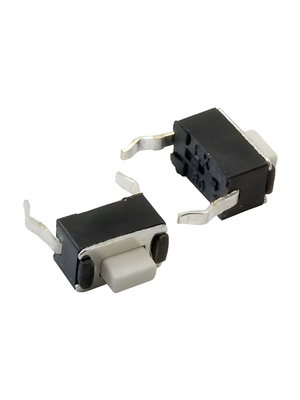
- Цветной дисплей TFT LCD 1,8" (128×160) – экран отображения информации.  
  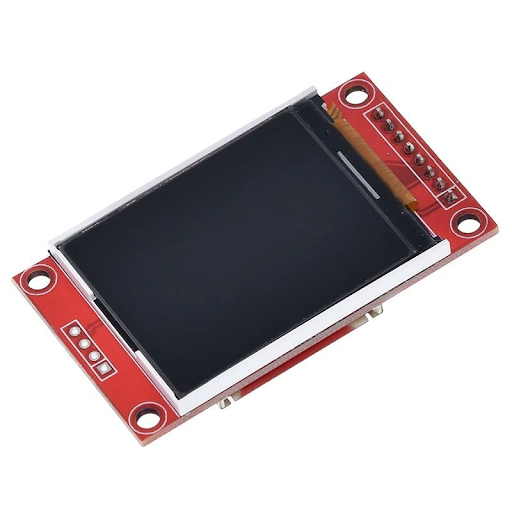
- Поворотный энкодер – тумблер управления временем.  
  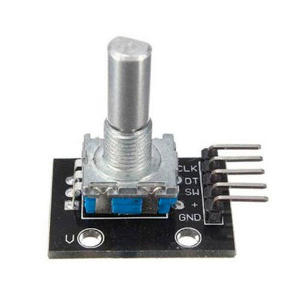
- Плата Arduino Nano – управляющий элемент.  
  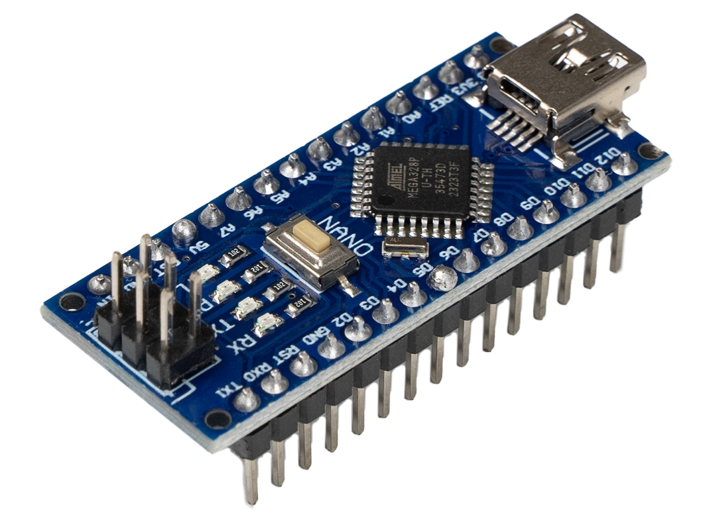
- RTC модуль (DS1302) – часы реального времени.  
  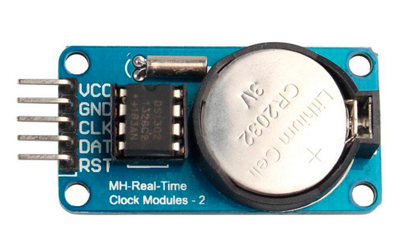

По умолчанию показывает время; при нажатии дополнительной кнопки переходит в режим Pomodoro-таймера. Пользователь нажатием на ручку энкодера попадает в режим настройки временных интервалов: вращением регулирует удобное время работы/отдыха. На экран выводится номер текущего интервала, его вид (отдых или работа), а также оставшееся время.

Устройство предназначено для **повышения продуктивности**. Метод Помодоро эффективен, так как разбивает работу на короткие контролируемые интервалы (25 минут работы и 5 минут отдыха), помогает бороться с прокрастинацией, улучшает концентрацию, снижает умственную усталость и предотвращает выгорание. Особенность данной реализации — **особая компактность**.

### Принципиальная схема

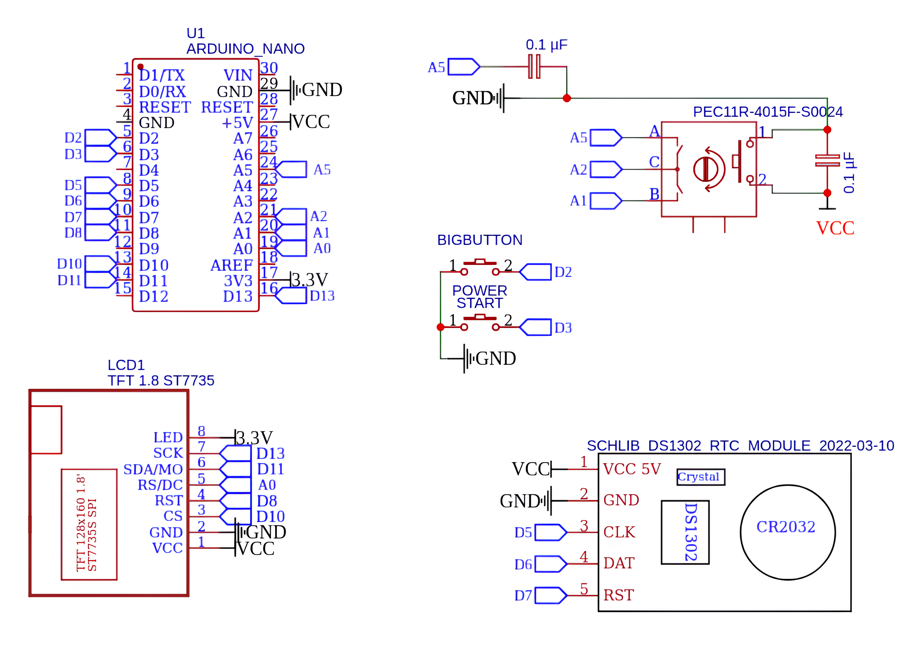

### Разработка печатной платы

Печатная плата — **двухслойная**. Предусмотрены 4 отверстия для крепления к корпусу.

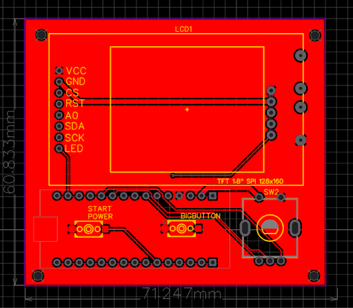
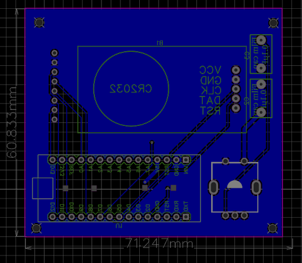

Плату можно конвертировать в 3D-модель, что полезно при дальнейшем проектировании корпуса (КОМПАС, Fusion 360, Blender). Некоторые компоненты не имеют своих 3D-моделей, поэтому они не отображаются.

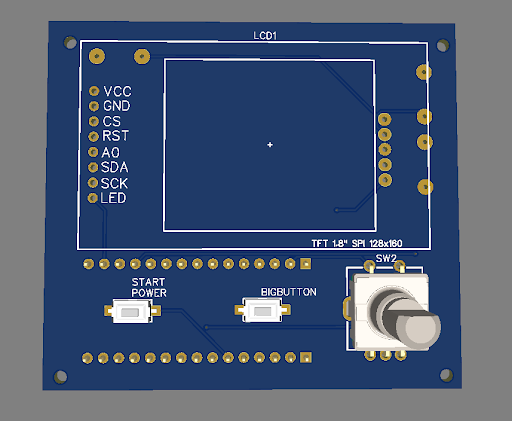
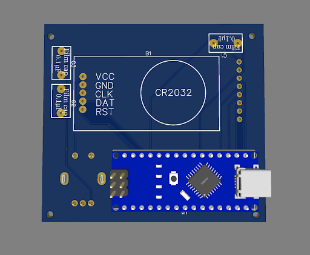

### Проектирование корпуса

Корпус спроектирован в **Blender** и состоит из двух половинок. Лицевая часть имеет прямоугольный вырез под дисплей, два под кнопки и круглый под энкодер. Сзади — вырез под разъём питания Arduino Nano. Для платы предусмотрены 4 крепления под винты **M1,6×8 мм**. По торцам — ещё 4 отверстия глубиной 6.5 мм для скрепления половинок.

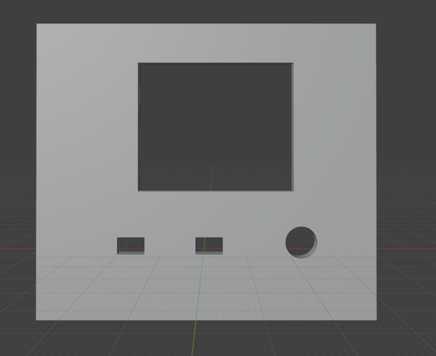
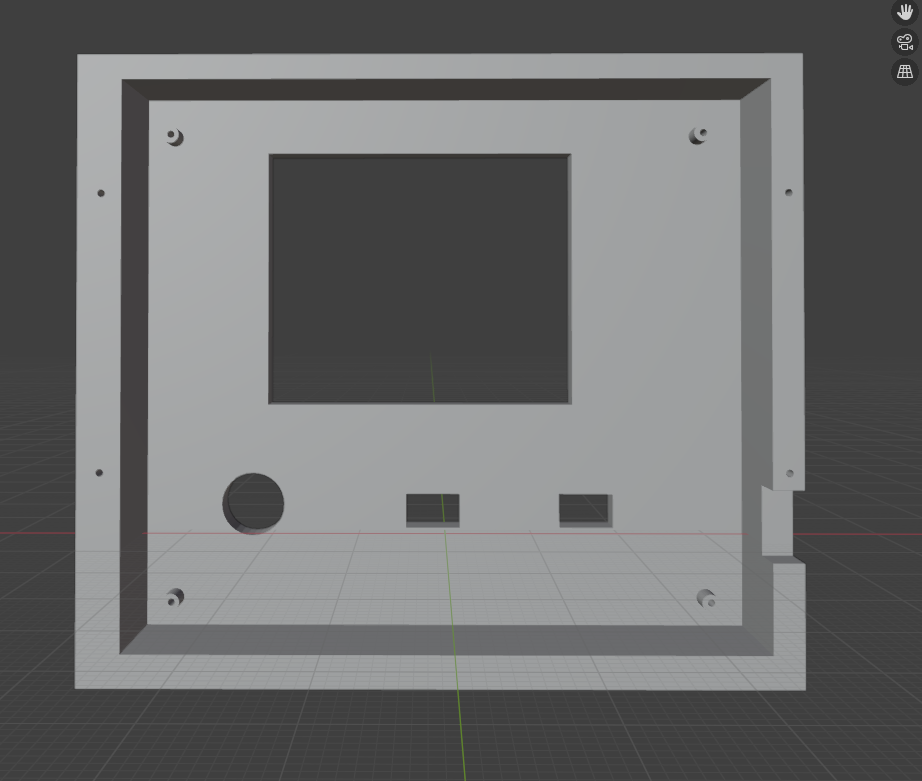

Тыльная часть — крышка. Толщина тонкой стенки 3 мм, есть 4 углубления (1,5 мм глубиной, диаметр 2 мм).

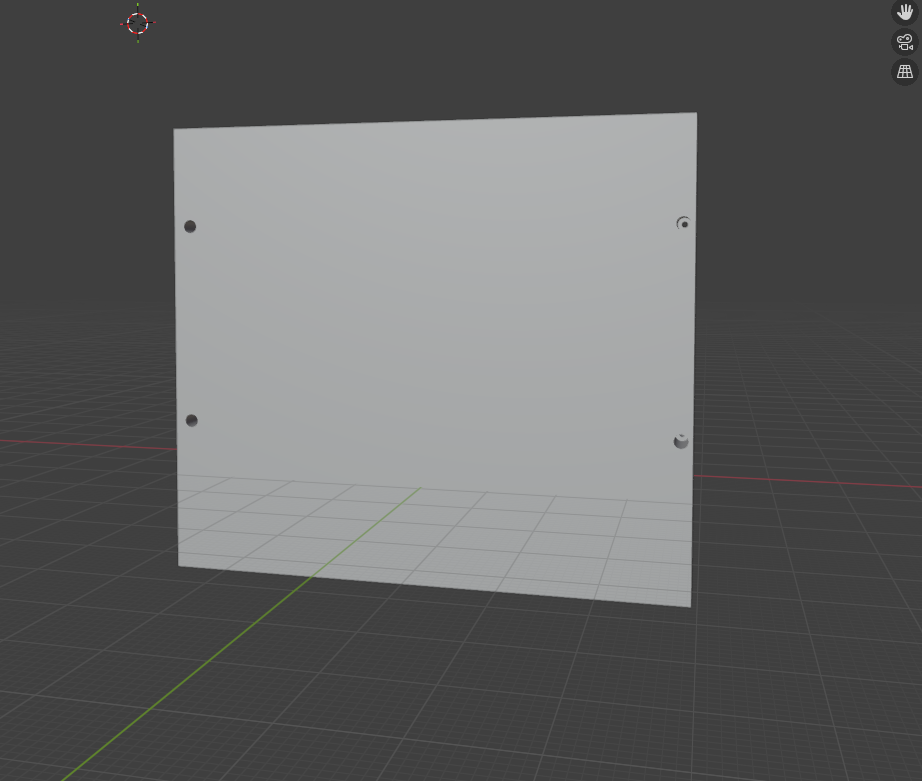
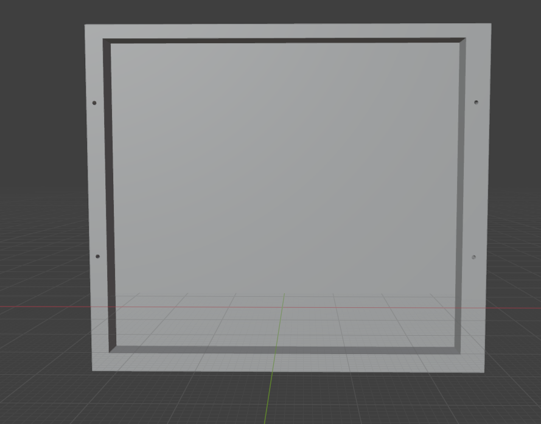

Собранное устройство в X-ray режиме:

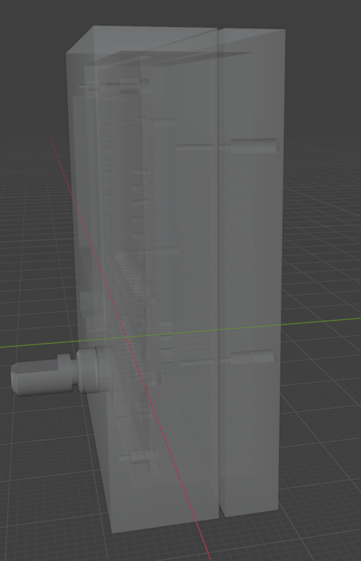
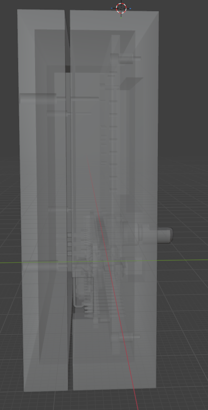
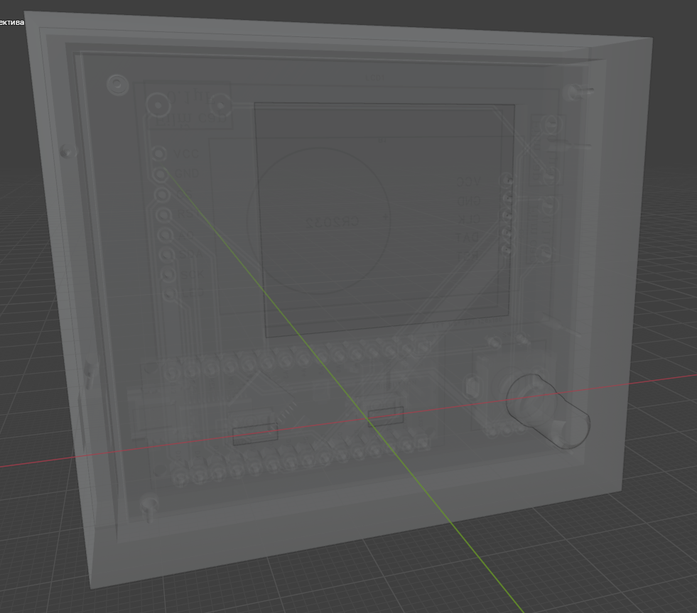

### Описание функционала

Устройство представляет собой **Помодоро-таймер с часами** для повышения эффективности по методу Помодоро (25 мин работы / 5 мин отдыха, длинный перерыв после 4 циклов).

**Функции:**
- Установка времени долгим нажатием кнопки Start
- Помодоро-таймер с настраиваемыми интервалами
- Управление энкодером с кнопкой (поворот — смена значений/выбор в меню, нажатие — подтверждение/выбор)
- Возможность поставить таймер на паузу
- Выход в меню часов по долгому нажатию кнопки энкодера

**Модули:**
- Две кнопки: Start (запуск) и Pause (пауза/возобновление)
- Цветной LCD-дисплей 128×160
- Модуль часов реального времени (автоматическая загрузка времени при первом включении)
- Поворотный энкодер с кнопкой

Устройство выводит опыт использования помодоро-таймеров на новый уровень: во-первых, в отличие от приложений на телефон, оно даёт **тактильные ощущения** и более глубокое взаимодействие. Во-вторых, **невозможно выйти из режима работы или отдыха** — люди часто пренебрегают отдыхом, поэтому из отдыха выйти нельзя; из работы — тоже, ведь начатое дело нужно доводить до конца.

Главный экран — минималистичные часы в гик-стиле — служит эстетичным украшением рабочего места, даже если владелец не пользуется таймером.

### Реализованный проект

На изображении ниже — главный экран. По нажатию кнопки Start устройство переходит в режим помодоро-таймера с последними настройками. Для изменения интервалов нужно нажать кнопку энкодера и задать значения.

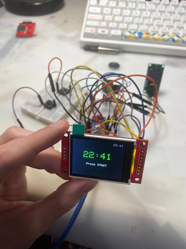
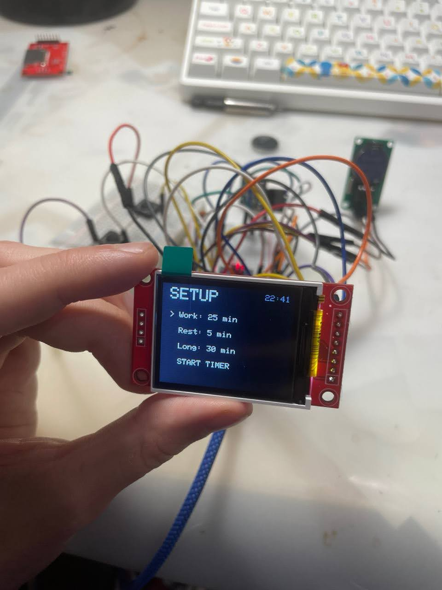

Для запуска таймера выбирается пункт «Start timer» и нажимается кнопка энкодера. Устройство переходит в режим помодоро. В правом верхнем углу отображается текущее время, по центру — номер текущей «помидорки».

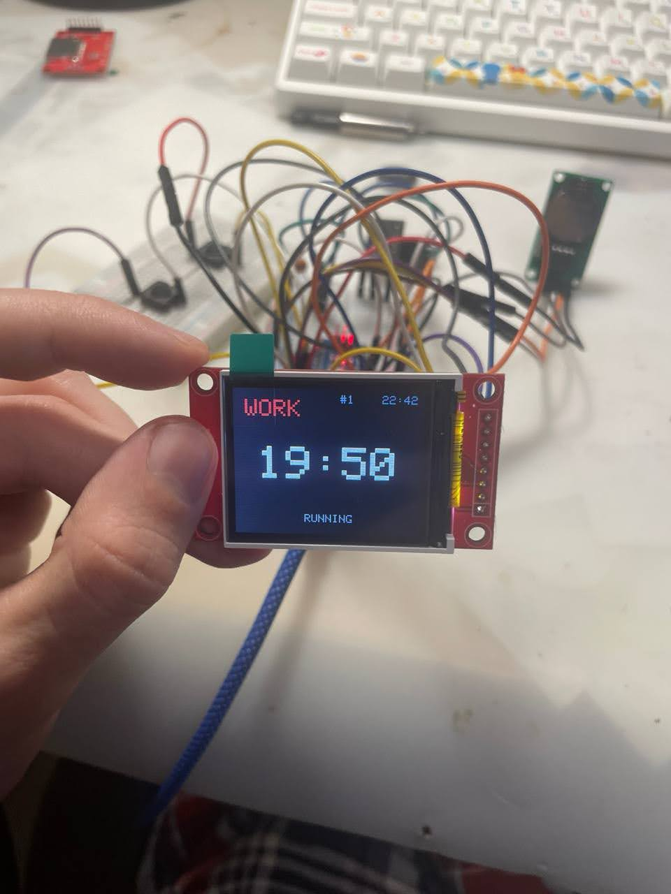

### Заключение

В ходе выполнения курсовой работы была успешно решена задача проектирования и реализации цифрового устройства — «Pomodoro Timer». Разработана аппаратная часть на базе Arduino Nano, DS1302, ST7735, энкодера и тактовых кнопок; спроектирована принципиальная схема, двухслойная печатная плата, 3D-модель корпуса. Написан и отлажен код прошивки, реализующий логику часов, алгоритм таймера и систему меню. Создан действующий прототип, полностью соответствующий техническому заданию.

Цель курсовой работы достигнута. Устройство представляет собой законченный цифровой продукт, готовый к эксплуатации. Выполнение работы закрепило практические навыки полного цикла проектирования электронных устройств: от схемы и платы до программирования и создания корпусных элементов.

---

## 📄 License

This project is licensed under the MIT License – see the [LICENSE](LICENSE) file for details.
